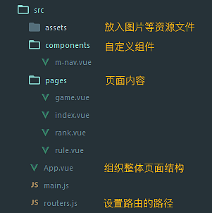

## 简介

自用的移动端活动专题模板，基于官方模板 [webpack-simple](https://github.com/vuejs-templates/webpack-simple) 做了如下改动：

- 添加 Less 支持

- 添加移动端支持和 Bootstrap 样式

- 添加路由功能，配置文件是 `routers.js`

- 添加自定义组件

## 文档结构



## 安装

#### 使用淘宝 NPM 镜像

建议使用淘宝 cnpm (gzip 压缩支持) 命令行工具代替默认的 npm:

```bash
$ npm install -g cnpm --registry=https://registry.npm.taobao.org
```

之后使用 cnpm 命令来替换 npm，将从淘宝镜像开始下载：

```bash
$ cnpm install [name]
```

#### 命令行

``` bash
# 安装依赖
npm install

# 开启本机测试环境 localhost:8080
npm run dev

# 生成生产文件
npm run build
```

## 组件

尝试写了几个组件，待后续完善:)

#### m-nav

底部导航

#### m-register

带输入框的弹出窗口

#### m-tab

选项卡

```html
<m-tab>
  <m-tabcon label="项目1" :active="true">内容1</m-tabcon>
  <m-tabcon label="项目2">内容2</m-tabcon>
  <m-tabcon label="项目3">内容3</m-tabcon>
</m-tab>
```

---

参考链接：

[element](https://github.com/ElemeFE/element/tree/dev/packages)

[vux](https://github.com/airyland/vux/tree/master/src/components)
