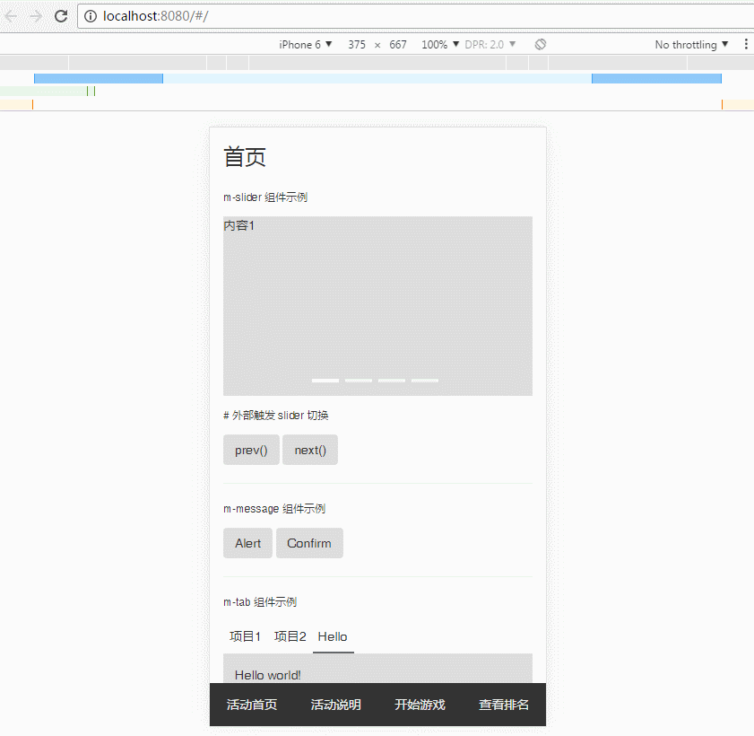

# 简介

自用的移动端活动专题模板，基于官方模板 [webpack-simple](https://github.com/vuejs-templates/webpack-simple) 做了如下改动：

- [x] 添加 Less 支持

- [x] 添加移动端支持和 Bootstrap 样式

- [x] 添加路由功能，配置文件是 `routers.js`

- [x] 添加自定义组件

- [x] 添加 Vuex



## 文档结构


## 新增【简易版】

不使用 Webpack 打包，方便后端直接修改 HTML 文件；

【简易版】使用 Gulp 压缩，支持 ES6 语法。

## 安装

### 使用淘宝 npm 镜像

建议使用淘宝 cnpm (gzip 压缩支持) 命令行工具代替默认的 npm:

```bash
$ npm install -g cnpm --registry=https://registry.npm.taobao.org
```

之后使用 cnpm 命令来替换 npm，将从淘宝镜像开始下载。

### 命令行

``` bash
# 安装依赖
npm install

# 开启本机测试环境 localhost:8080
npm run dev

# 生成生产文件
npm run build
```

## 可用组件

### m-nav

底部导航

### m-message

提示框

```html
<m-message type="alert">
  <button class="btn">Alert</button>
</m-message>

<m-message
  type="confirm"
  title="等待确认"
  content="要执行操作吗？"
  @confirm="msgEvent">
  <button class="btn">Confirm</button>
</m-message>
```

### m-slider

轮播图

```html
<m-slider height="200px" ref="slider">
  <m-slider-list v-for="list in lists" :key="list">
    {{ list }}
  </m-slider-list>
</m-slider>
```

### m-tab

选项卡

```html
<m-tab>
  <m-tabcon label="项目1" :active="true">内容1</m-tabcon>
  <m-tabcon label="项目2">内容2</m-tabcon>
  <m-tabcon label="项目3">内容3</m-tabcon>
</m-tab>
```

### m-register

带输入框的弹出窗口

### m-roulette

转盘抽奖

## 参考链接

[element](https://github.com/ElemeFE/element/tree/dev/packages)

[vux](https://github.com/airyland/vux/tree/master/src/components)
